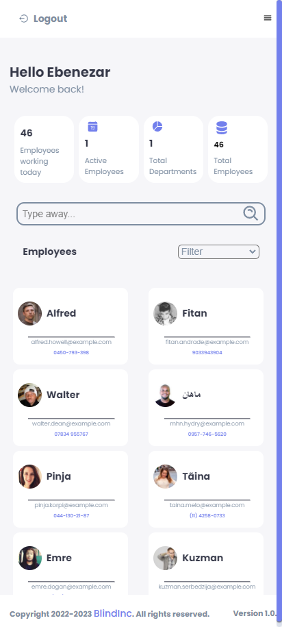
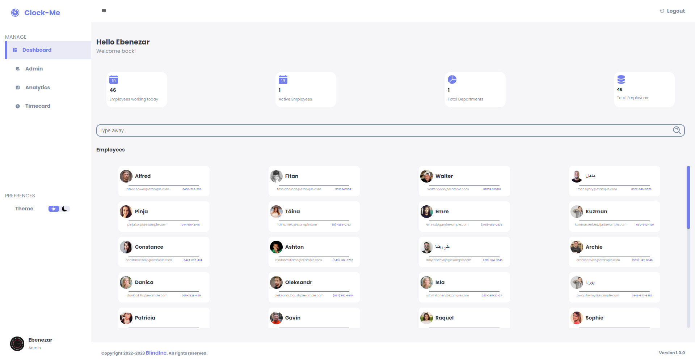
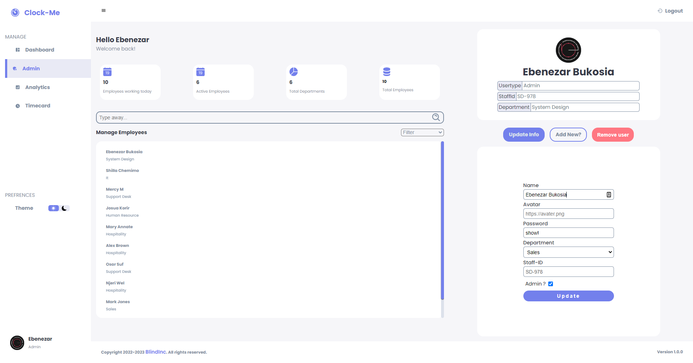
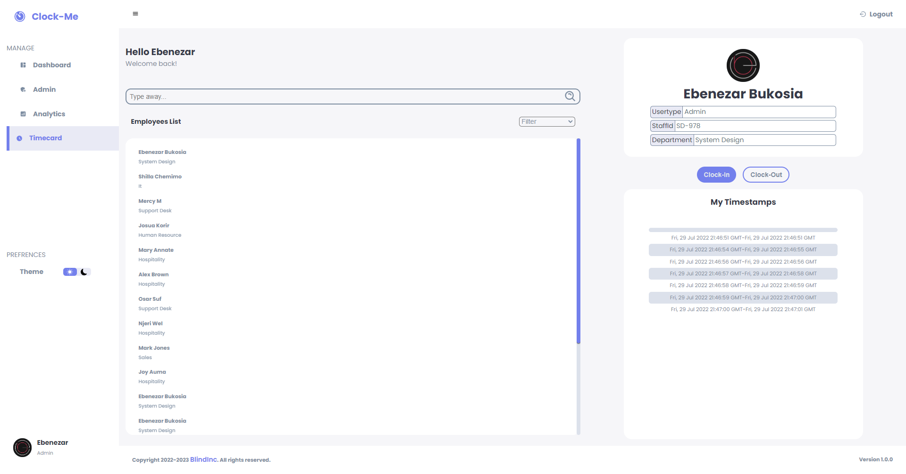

# CLOCK-ME

---

### Author : BUKOSIA EBENEZAR

---

## Project Description

Clock-me: is is a web application used to keep track of employees and thier clock-in and clock out time and also calculates their salary based on total clocked time.

---
## Project Blog

`https://medium.com/@ebenezarbukosia/clock-me-web-application-react-9d425b5aa8ee`
---

## SCREENSHOTS

### Mobile View

#### 

### Login

#### 

### Dashboard Panel

#### 

### Admin Panel

#### 

### Timecard Panel

#### 

## Table of content

- [Technologies](#description)
- [Description](#description)
- [Features](#features)
- [Setup-process](#setup_process)
- [Project-usage](#project-usage)
- [Licence](#licence)
- [Copyright](#copyright)

---

## Technologies

languages used are:

1. React
2. Sass

---

### Features

- As a employee you can be able to:

1. Login with his/her account.
2. Record and track his/her timestamp.
3. view company analytics

- AS an admin you can be able to:

4. Add new employees.
5. Update employees details.
6. Delete an Employee

---

### description

This web application helps to solve the problem of tracing employees working time. This can be very essential espesialy jobs that pays thier employees on hourly basis.
the application is also beneficial to a any company since it enables them track thier working times of thier employees and know how to optimize make thiem efficient.
the application solve this such as recoding each day's clock-in and clock-out timestamp and record it in the database as string array. the application then uses the timestamps to calculate how many hours the employee has been working and compute the employees salary.

---

### challenges

- Implementing login authentification.
- Implementing theme change.

---

## How to set up and run the project

### Requirements

- [npm](https://www.npmjs.com/)
- Text editor eg [Visual Studio Code](https://code.visualstudio.com/download)

---

### Dependencies

- npm

---

### setup

clone the repo using the command

- `git clone https://github.com/Ebenezr/clock-me-react.git`

change directory using command

- `cd clock-me-react`

open project in vscode texteditor

- `code .`

install dependancies packages

- `run npm install`

run back end

- `npm run server`

run front end

- `npm start`

---

#### live link

- run the following live link in your browser https://clock-me.herokuapp.com

## How to use the project

---

### Contributing to project

- Fork the repo

* Create a new branch in your terminal (git checkout -b improve-feature)
* Install the prerequisites
* Make appropriate changes in file(s)
* Run the server to see the changes
* Add the changes and commit them (git commit -am "Improve App")
* Push to the branch (git push origin improve-app)
* Create a Pull request

---

## Copyright

Copyright(c)[2022][bukosia ebenezar]

---

## Contact Information

- Email : ebenezarbukosia@gmail.om

---

## [License](LICENSE)

MIT License
Copyright (c) 2022 Bukosia Ebenezar
